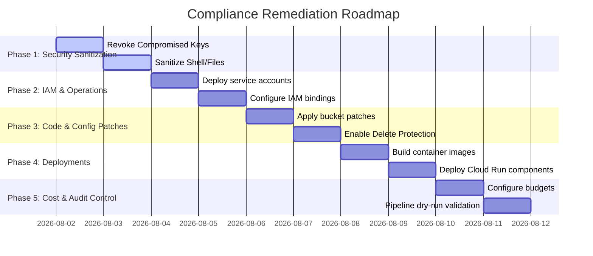

# Remediation Priority Roadmap
**Project ID:** `friday-media-os`  
**Status:** Implementation Roadmap Reference  

This document defines the prioritizations, risks, impacts, dependencies, rollback strategies, and exact validation CLI commands for remediating the findings identified during the security and compliance audit.

---

## FINDINGS & PRIORITIZATIONS

### Finding 1: Exposed Credentials (API Keys)
*   **Priority:** P0 (Critical Security Issue)
*   **Risk:** Critical. Cleartext credentials are exposed in history and flat files, presenting an immediate key hijack risk.
*   **Business Impact:** High. Uncontrolled financial liabilities from third-party model quota consumption.
*   **Technical Impact:** High. Allows arbitrary API invocations under the project billing context.
*   **Security Impact:** High. Absolute compromise of API-level access boundaries.
*   **Estimated Effort:** Low (15 minutes).
*   **Downtime Required:** None.
*   **Rollback Required:** No (keys cannot be un-revoked; if deleted in error, fresh keys must be generated).
*   **Dependencies:** None.
*   **Exact Files Involved:**
    *   `/home/khmzamantonmoy/gemini_key.txt` (to be deleted)
    *   `/home/khmzamantonmoy/friday-media-os-backup/.env` (to be deleted)
    *   `/home/khmzamantonmoy/.bash_history` (to be cleared)
*   **Exact GCP Resources Involved:** 
    *   Google AI Studio API Key Registry
    *   GCP Credentials API Registry
*   **Verification Commands:**
    ```bash
    # Verify file deletion
    ls ~/gemini_key.txt 2>&1 | grep "No such file or directory"
    grep -rn "AIzaSy" /home/khmzamantonmoy/friday-media-os-backup/ 2>&1
    ```
*   **Rollback Commands:** N/A (Regenerate new credentials in the console if necessary).

---

### Finding 2: Persistent Workloads inside Cloud Shell
*   **Priority:** P0 (ToS Compliance Violation)
*   **Risk:** Critical. Persistent dashboard hosting and resource-heavy FFmpeg rendering inside Cloud Shell violate Acceptable Use Policies.
*   **Business Impact:** Total interruption if Google Cloud suspends the project.
*   **Technical Impact:** Compute environment shutdown.
*   **Security Impact:** Medium.
*   **Estimated Effort:** Medium (1-2 hours).
*   **Downtime Required:** None (the environment is currently stopped).
*   **Rollback Required:** No.
*   **Dependencies:** None.
*   **Exact Files Involved:** Administrative operational practices.
*   **Exact GCP Resources Involved:** Cloud Shell environment instance.
*   **Verification Commands:**
    ```bash
    ps aux | grep -E "streamlit|python"
    ```
*   **Rollback Commands:** N/A.

---

### Finding 3: Hardcoded GCS Bucket Name in Active Codebase
*   **Priority:** P1 (Operational Failure)
*   **Risk:** High. The pipeline attempts to write generated content to an external, potentially inaccessible bucket (`friday-media-assets-prod`), causing runtime failures.
*   **Business Impact:** Failure of video delivery pipelines, stopping all system output.
*   **Technical Impact:** Pipeline crashes at audio, image, and rendering stages.
*   **Security Impact:** Medium (avoids exfiltrating assets to external environments).
*   **Estimated Effort:** Low (30 minutes).
*   **Downtime Required:** None.
*   **Rollback Required:** Yes.
*   **Dependencies:** GCS Bucket `gs://friday-media-assets-friday-media-os` must exist.
*   **Exact Files Involved:**
    *   `src/workers/voice_worker.py`
    *   `src/workers/image_worker.py`
    *   `src/workers/render_worker.py`
*   **Exact GCP Resources Involved:** Cloud Storage Bucket `gs://friday-media-assets-friday-media-os`.
*   **Verification Commands:**
    ```bash
    grep -rn "friday-media-assets-prod" src/
    ```
*   **Rollback Commands:**
    ```bash
    git checkout src/workers/voice_worker.py src/workers/image_worker.py src/workers/render_worker.py
    ```

---

### Finding 4: Missing Scoped Least-Privilege Service Accounts
*   **Priority:** P1 (Privilege Hardening)
*   **Risk:** High. Containers run under the default compute service account with broad editor permissions.
*   **Business Impact:** A web application compromise would grant attackers access to write/delete any resource in the project.
*   **Technical Impact:** High (enforces restricted component execution contexts).
*   **Security Impact:** High (mitigates lateral movement risks).
*   **Estimated Effort:** Low (30 minutes).
*   **Downtime Required:** None.
*   **Rollback Required:** Yes.
*   **Dependencies:** None.
*   **Exact Files Involved:**
    *   `setup_gcp_safe.sh`
    *   `deploy.sh`
*   **Exact GCP Resources Involved:** Project IAM Policies, IAM Service Accounts `sa-media-ui`, `sa-media-pipeline`.
*   **Verification Commands:**
    ```bash
    gcloud iam service-accounts list
    gcloud projects get-iam-policy friday-media-os --format=json
    ```
*   **Rollback Commands:**
    ```bash
    gcloud iam service-accounts delete sa-media-ui@friday-media-os.iam.gserviceaccount.com --quiet
    gcloud iam service-accounts delete sa-media-pipeline@friday-media-os.iam.gserviceaccount.com --quiet
    ```

---

### Finding 5: Publicly Accessible UI Dashboard Configuration
*   **Priority:** P1 (Security Vulnerability)
*   **Risk:** High. Unauthenticated dashboards allow anyone to trigger costly AI operations, enabling Denial of Wallet (DoW) attacks.
*   **Business Impact:** Potential billing surges from external abuse.
*   **Technical Impact:** High API invocation load.
*   **Security Impact:** High (restricts system invoke rights to authorized operators).
*   **Estimated Effort:** Medium (2 hours).
*   **Downtime Required:** None.
*   **Rollback Required:** Yes.
*   **Dependencies:** Cloud Run UI deployment.
*   **Exact Files Involved:**
    *   `deploy.sh`
*   **Exact GCP Resources Involved:** Cloud Run Service `media-ui` IAM policy.
*   **Verification Commands:**
    ```bash
    gcloud run services get-iam-policy media-ui --region=us-central1 --format=json
    ```
*   **Rollback Commands:**
    ```bash
    gcloud run services add-iam-policy-binding media-ui --region=us-central1 --member="allUsers" --role="roles/run.invoker"
    ```

---

### Finding 6: Project-Wide GCS Permissions
*   **Priority:** P2 (Access Scope Isolation)
*   **Risk:** Medium. Pipeline account possesses admin access across all storage buckets in the project.
*   **Business Impact:** Low to Medium.
*   **Technical Impact:** Isolation of storage write environments.
*   **Security Impact:** Medium (enforces bucket-level least privilege).
*   **Estimated Effort:** Low (15 minutes).
*   **Downtime Required:** None.
*   **Rollback Required:** Yes.
*   **Dependencies:** Service account creation.
*   **Exact Files Involved:**
    *   `setup_gcp_safe.sh`
*   **Exact GCP Resources Involved:** Storage Bucket IAM policy bindings.
*   **Verification Commands:**
    ```bash
    gcloud storage buckets get-iam-policy gs://friday-media-assets-friday-media-os --format=json
    ```
*   **Rollback Commands:**
    ```bash
    gcloud projects add-iam-policy-binding friday-media-os --member="serviceAccount:sa-media-pipeline@friday-media-os.iam.gserviceaccount.com" --role="roles/storage.objectAdmin"
    ```

---

### Finding 7: Missing Billing Budgets and Alerts
*   **Priority:** P2 (Financial Control)
*   **Risk:** Medium. Absence of budget policies leads to a lack of visibility on resource costs.
*   **Business Impact:** Risk of sudden financial outlays.
*   **Technical Impact:** None (notifications only).
*   **Security Impact:** None.
*   **Estimated Effort:** Low (20 minutes).
*   **Downtime Required:** None.
*   **Rollback Required:** Yes.
*   **Dependencies:** Billing account permissions.
*   **Exact Files Involved:**
    *   `setup_gcp_safe.sh`
*   **Exact GCP Resources Involved:** Cloud Billing Budget Configuration.
*   **Verification Commands:**
    ```bash
    gcloud billing budgets list --billing-account=0102D8-1CAE52-A4A432 --format=json
    ```
*   **Rollback Commands:**
    ```bash
    # Note: Replace budget ID with actual created budget identifier
    gcloud billing budgets delete [BUDGET_ID] --billing-account=0102D8-1CAE52-A4A432 --quiet
    ```

---

### Finding 8: Disabled Firestore Database Delete Protection
*   **Priority:** P2 (Data Protection)
*   **Risk:** Medium. Databases are exposed to accidental deletion.
*   **Business Impact:** Irreparable loss of application metadata and state logs.
*   **Technical Impact:** Medium.
*   **Security Impact:** None (focuses on integrity and availability).
*   **Estimated Effort:** Low (5 minutes).
*   **Downtime Required:** None.
*   **Rollback Required:** Yes.
*   **Dependencies:** Firestore native database initialization.
*   **Exact Files Involved:**
    *   `setup_gcp_safe.sh`
*   **Exact GCP Resources Involved:** Firestore Database configurations.
*   **Verification Commands:**
    ```bash
    gcloud firestore databases describe --database='(default)' --format="value(deleteProtectionState)"
    ```
*   **Rollback Commands:**
    ```bash
    gcloud firestore databases update --database='(default)' --no-delete-protection
    ```

---

### Finding 9: Hardcoded Project ID in Cloud Build configurations
*   **Priority:** P3 (Pipeline Portability)
*   **Risk:** Low. Build manifests attempt to reference external projects.
*   **Business Impact:** Low.
*   **Technical Impact:** Deployment errors due to configuration friction.
*   **Security Impact:** None.
*   **Estimated Effort:** Low (15 minutes).
*   **Downtime Required:** None.
*   **Rollback Required:** Yes.
*   **Dependencies:** None.
*   **Exact Files Involved:**
    *   `cloudbuild-ui.yaml`
    *   `cloudbuild-pipeline.yaml`
*   **Exact GCP Resources Involved:** Container image tag namespaces.
*   **Verification Commands:**
    ```bash
    grep -rn "friday-media-prod" *.yaml
    ```
*   **Rollback Commands:**
    ```bash
    git checkout cloudbuild-ui.yaml cloudbuild-pipeline.yaml
    ```

---

### Finding 10: Syntax Errors in deploy.sh
*   **Priority:** P3 (General Improvement)
*   **Risk:** Low. Unrecognized argument tags cause build failures.
*   **Business Impact:** None.
*   **Technical Impact:** Builds fail to submit from the shell.
*   **Security Impact:** None.
*   **Estimated Effort:** Low (10 minutes).
*   **Downtime Required:** None.
*   **Rollback Required:** Yes.
*   **Dependencies:** None.
*   **Exact Files Involved:**
    *   `deploy.sh`
*   **Exact GCP Resources Involved:** None.
*   **Verification Commands:** Run build execution and check logs.
*   **Rollback Commands:**
    ```bash
    git checkout deploy.sh
    ```

---

## IMPLEMENTATION SCHEDULE



### Phase 1: Critical Security Sanitization (P0)
*   **Objective:** Eliminate exposed plaintext API credentials and block any interactive script execution inside Cloud Shell.
*   **Sequence:**
    1.  Revoke the exposed Google AI Studio and YouTube keys in their respective consoles.
    2.  Delete `~/gemini_key.txt` and `/home/khmzamantonmoy/friday-media-os-backup/.env`.
    3.  Clear command history logs.
    4.  Verify no running Streamlit or Python servers remain in Cloud Shell.

### Phase 2: IAM & Operational Foundation (P1)
*   **Objective:** Set up project-level security configurations and create least-privilege service accounts.
*   **Sequence:**
    1.  Create service accounts `sa-media-ui` and `sa-media-pipeline`.
    2.  Bind project-level roles (`roles/datastore.viewer`, `roles/run.developer`, `roles/datastore.user`, and `roles/aiplatform.user`).
    3.  Create the Artifact Registry docker repository `media-pipeline`.

### Phase 3: Source Code & Configuration Patches (P1/P2)
*   **Objective:** Remove environment-specific dependencies from code and configuration manifests.
*   **Sequence:**
    1.  Apply patches in `src/workers` files to dynamically retrieve GCS bucket names.
    2.  Update `cloudbuild-ui.yaml` and `cloudbuild-pipeline.yaml` with `$PROJECT_ID`.
    3.  Patch syntax errors in `deploy.sh`.
    4.  Enable database delete protection on Firestore default database.

### Phase 4: Secured Compute Deployments (P1/P2)
*   **Objective:** Build secure images and deploy to Cloud Run services and jobs without public invoker access.
*   **Sequence:**
    1.  Build UI and Pipeline container images via Cloud Build.
    2.  Deploy `media-ui` to Cloud Run Service with invoker restriction (`--no-allow-unauthenticated`).
    3.  Deploy `media-pipeline` to Cloud Run Job.

### Phase 5: Financial Defense & Audit Verification (P2)
*   **Objective:** Establish billing alert policies and verify that all system pipelines operate within security limits.
*   **Sequence:**
    1.  Create the dedicated billing budget and notify threshold limits.
    2.  Run a test job execution of `media-pipeline` and verify output in GCS and Firestore.
    3.  Re-audit project IAM bindings.
